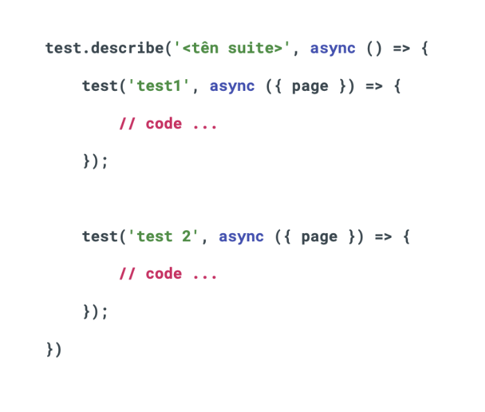
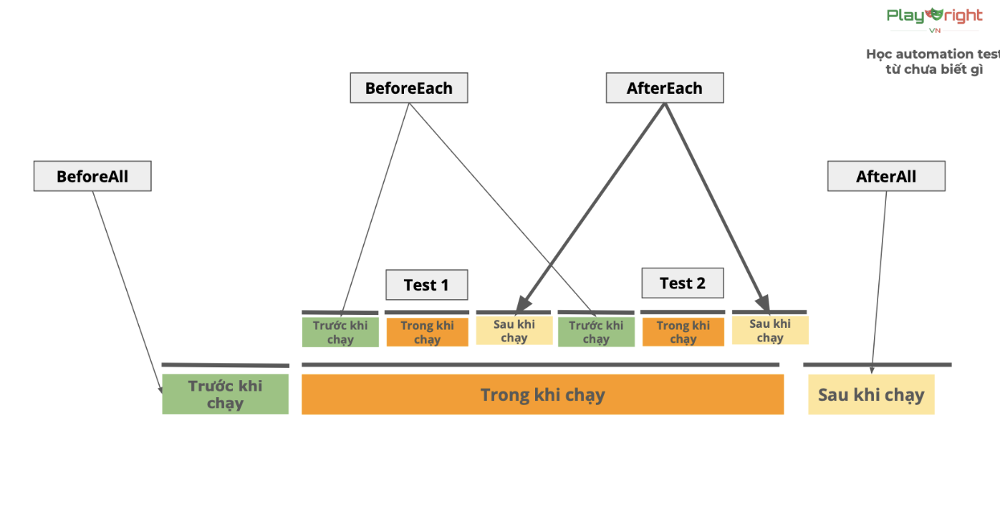
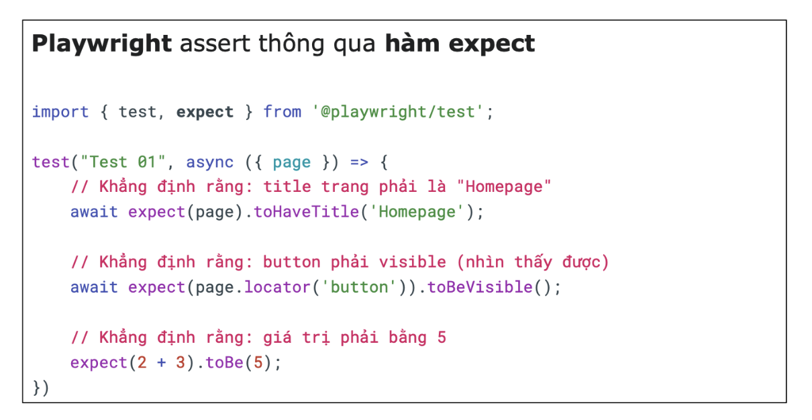
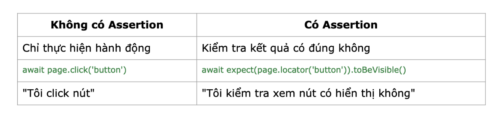
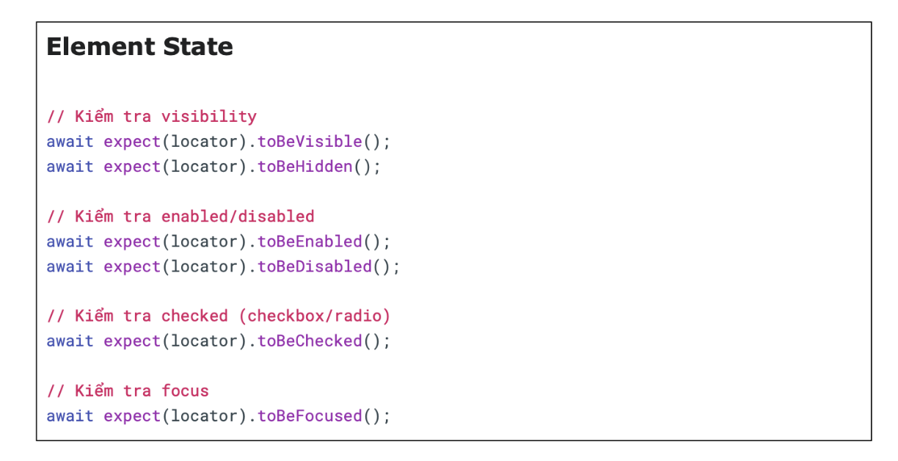
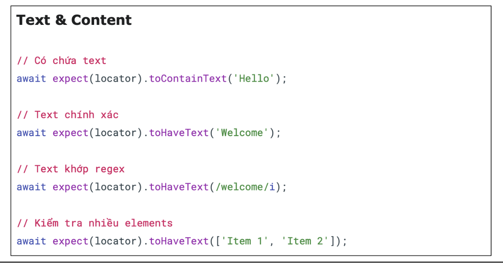
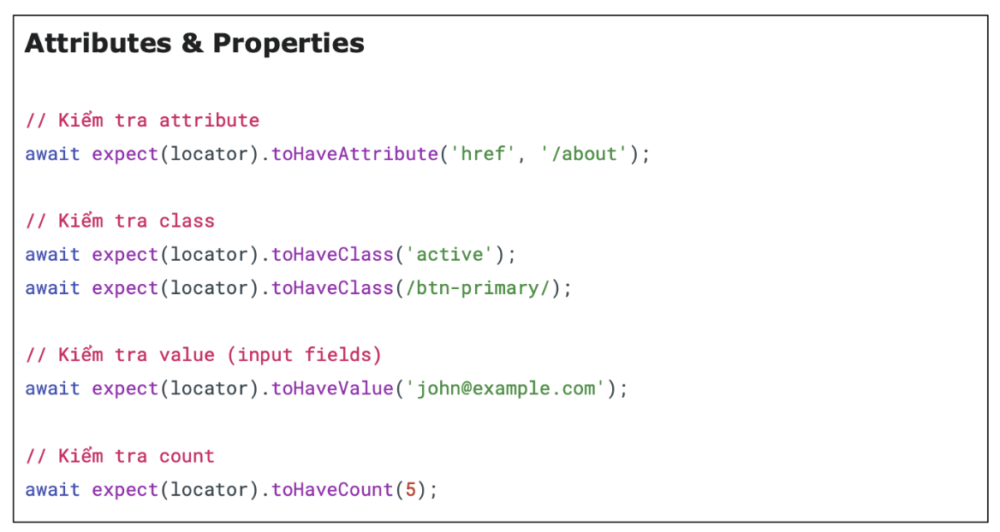
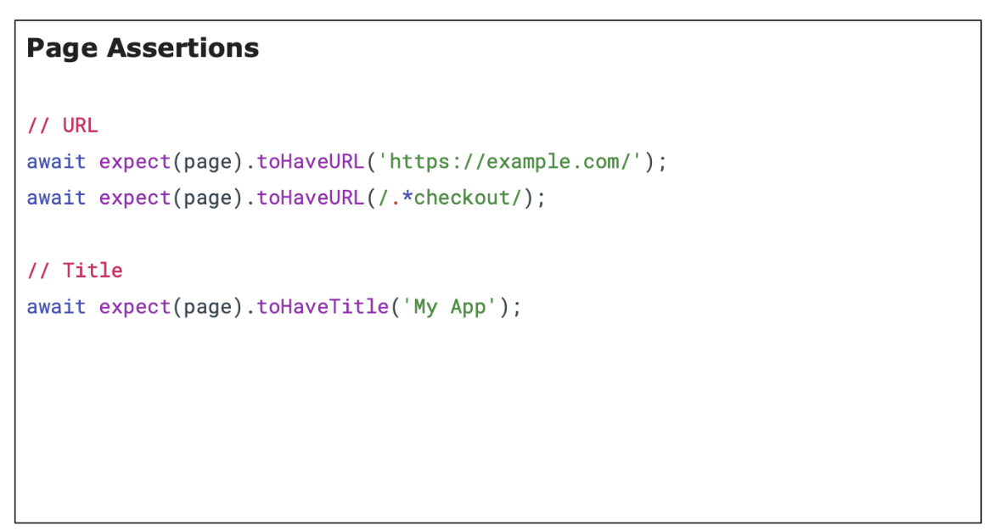
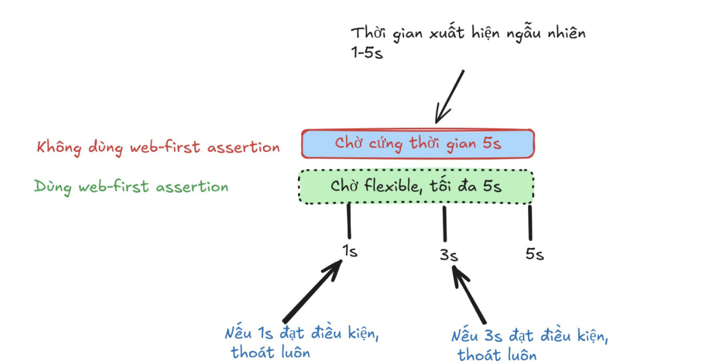

1. Test describe
- test suite: tập hợp testcase 
- giúp nhóm các test lại cho dễ dàng quản lý 

2. Test hooks
- Các thời điểm chạy test: Trước khi chạy, TRong khi chạy, và sau khi chạy 
- Các thời điểm chạy suite: Trước khi chạy, TRong khi chạy, và sau khi chạy 
- Playwright: Gọi các thời điểm này là hooks
- Các hooks:
    + beforeAll
    + beforeEach
    + afterEach
    + afterAll

3. Assertion
- Định nghĩa: là khẳng định hoặc xác nhận, là một câu lệnh để kiểm tra xem một điều gì đó có đúng như mong đợi hay không.
- Không có assertion = không biết test có thành công hay thất bại.

- Các loại assertion
    + Generic Assertion( từ thư viện expect)
    > expect(giá trị) = (giá trị)
    + Web-first Assertions (auto - waiting)
    > expect (phần tử) có giá trị

