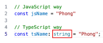
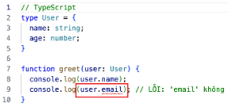
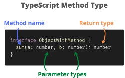
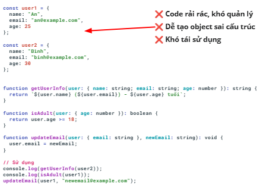
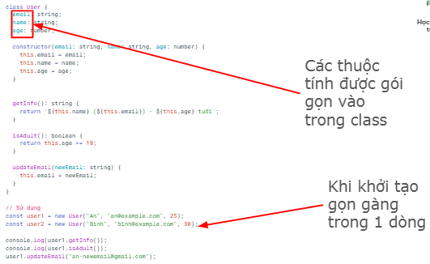
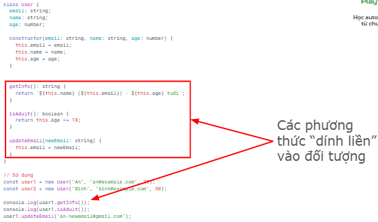
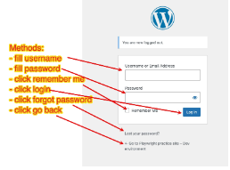
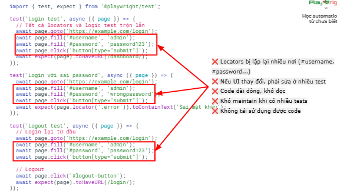
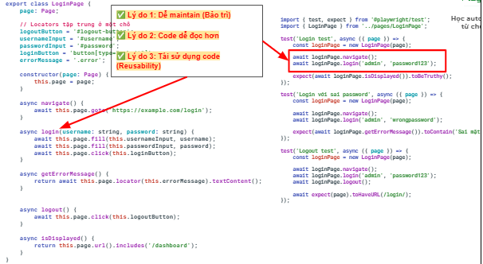

# Lesson 10
## Agenda
1. Typescript: so sánh với javascript
2. Typescript: kế thừa
3. Page Object Model
---
## Typescript & Javascript
**Typescript** là superset (mở rộng) của **Javascript**
- Javascript "dễ dãi" quá
    - => nhiều lỗi 
    - => Typescript ra đời để khó tính hơn
    - => giảm bớt lỗi hơn

Code **typescript** cần biên dịch qua **Javascript** trước khi chạy

`npm install -d typescript`

`npx tsx <file_path>`

Dùng **Typescript** vì có nhiều ưu điểm so với **Javascript**
- Có hệ thống kiểu dữ liệu


- Có phát hiện lỗi sớm


- Interface & type alias
- OOP feature
- Generic
- ...

## Key takeaways
- Chúng ta sẽ dùng **Typescript**
- Dùng lệnh `npx tsc <file_path>` để biên dịch file ts thành js
- Sau đó chạy bằng lệnh `node <file_path>`
---
## Typescript - Define type
Trong typescript, có thể định nghĩa kiểu dữ liệu thông qua **type** hoặc **interface**



Định nghĩa kiểu dữ liệu giúp code trở nên rõ ràng, dễ đọc hơn
- **type**
```
type <type_name> = {
    prop1: dataType1;
    prop2: dataType2;
    ...
}
```

```typescript
type User = {
    name: string;
    age: number;
}

const user1: User = {
    name: "alehoang",
    age: 10,
}
```
- **interface**
    - Lưu ý: interface không có dấu =

```typescript
interface User {
    name: string;
    age: number;
}

const user1: User = {
    name: "alehoang",
    age: 10,
}
```

## Khác nhau giữa type và interface
**Điểm giống** 

Cả 2 đều để định nghĩa cấu trúc dữ liệu

**Điểm khác**

1. **Interface có thể mở rộng (Declaration merging)**

```typescript
interface Animal {
    name: string;
}

interface Animal {
    age: number;
}
// Kết quả Animal có cả name và age
const dog: Animal = {
    name: "Chihuahua",
    age: 1,
};
```

**Type** không thể khai báo lại
```typescript
type Animal = { name: string };
type Animal = { age: number }; // Báo lỗi: Duplicate identifier
```

2. **Type linh hoạt hơn với Union và Intersection**

```typescript
//Union types
type Status = "active" | "inactive" | "pending"
type ID = string | number;

const myStatus1: Status = "pending"; // OK
const myStatus2: Status = "delete"; // NG

const myID: ID = 100; // number: OK
const hisID: ID = "100"; // string: OK
const herID: ID = true; // boolean: NG

//Intersection types
type Person = { name: string };
type Employee = { salary: number };
type Worker = Person & Employee; // { name: string, salary: number}
```

Interface phải dùng extends

```typescript
interface Person {
    name: string;
}

interface Employee extends Person {
    salary: number;
}
```

3. **Type có thể đặt tên cho Primitives, Union, Tuple**

```typescript
// Primitives
type Name = string;
type Age = number;
// nên có thể khai báo
const myName: string = "Phong";
const myName: Name = "Phong";

// Tuple
type Point = [number, number];

// Union
type Result = Success | Error;

// Interface không làm được
```

4. **Type có thể dùng Mapped Types**

```typescript
type Readonly<T> = {
    readonly [P in keyof T]: T[P];
};

type User = {
    name: string;
    age: number;
}

type ReadonlyUser = Readonly<User>;
// { readonly name: string; readonly age: number}
```

5. **Interface extends nhiều interface dễ đọc hơn**

```typescript
interface Colorful {
    color: string;
}

interface Circle {
    radius: number;
}

interface ColorfulCircle extends Colorful, Circle {}

// Type cũng lấy được nhưng dùng &
type ColorfulCircle = Colorful & Circle;
```

**Khi nào dùng gì**
- **Dùng interface khi:**
    - Định nghĩa Object/class structure
    - Cần declaration merging (thư viện, api)
    - Làm việc với OOP (class implements interface)
- **Dùng type khi:**
    - Cần Union hoặc Intersection types
    - Làm việc với Primitives, Tuple
    - Cần Mapped Types , Conditional Types
    - Muốn type chính xác, không merge

**Best practice**
- Quy tắc đơn giản:
    - **Interface cho objects** (đặc biệt là public API)
    - **Type cho mọi thứ còn lại** (unions, tuples, utilities)
- Nhất quán trong dự án:
    - Chọn 1 convention và giữ nguyên trong toàn bộ codebase

## Typescript - Class
**Nhắc lại về class**
- Dùng để mô hình hóa 1 đối tượng: có các thuộc tính (**properties**) và hành vi (**methods**)
    - property: các đặc tính
    - methods: các hành động mà đối tượng có thể có

Khi không dùng class



Khi dùng class





## Typescript - extends
**Extends** là cơ chế kế thừa (inheritance) cho phép 1 class thừa hưởng các thuộc tính, phương thức từ class cha

Hàm **super()** gọi tới hàm tạo của lớp cha

```typescript
class LoginPage {
    heading: string;
    ...

    constructor() {
        this.heading = "";
        ...
    }

    fillUsername(username: string) {
        console.log(`Filling username: ${username}`);
    }

    ...
}

class DashboardPage extends LoginPage {
    titleLoc: string;

    constructor() {
        super();
        this.titleLoc = titleLoc;
    }
}

const dashboard = new DashboardPage();
dashboard.fillUsername("alehoang");
```
---
## POM
POM là 1 design pattern - 1 cấu trúc code "sạch đẹp, dễ bảo trì"

**Hiểu đơn giản**

POM = class với:
- **properties**: là các thành phần của trang web


- **Methods**: là các hành động trên trang web
    - luôn bắt đầu bởi động từ



## Dùng POM và không dùng POM
Không dùng POM



Dùng POM



## Tiêu chuẩn của POM
Lưu ý: không có 1 chuẩn chung nào cho POM

Dựa trên:
- Framework
- Ngôn ngữ
- Author
- Sở thích
- Kinh nghiệm   

**Core concept**
- Mỗi page là 1 class
- Có thuộc tính và phương thức riêng