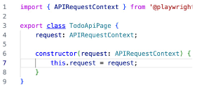
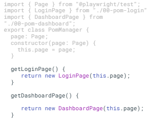
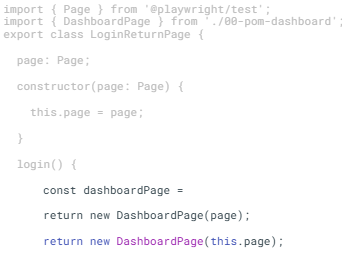

# Lesson 12
## Agenda
1. POM cho API
2. 1 số biến thể của POM
3. Async, await
---
## POM cho API là gì
- Tổ chức API ở dạng POM để dễ quản lý hơn
- Concept tương tự POM UI:
    - Tên class: TodoAPIPage
    - Thuộc tính: request: APIRequestContext

- Tư duy tương tự:
    - **Thuộc tính**: những gì cần thiết cho API: request fixture, baseURL
    - **Phương thức**: các hàm gọi API

## POM API nâng cao
- Lưu baseURL để khi gọi API ngắn gọn hơn
- Thêm thuộc tính **token** để lưu lại token với các API dùng token
---
## POM styles

**Có 3 kiểu chính**

1. **Kế thừa Page object** 
- Style đang sử dụng được gọi là "kế thừa" page phía trước
2. **POM manager**
- Quản lý nhiều page object.
- Các page object có thể được tạo và truy cập từ 1 nơi duy nhất.
- Các page object độc lập với nhau
- Các page chỉ được tạo khi cần thiết

3. **Return POM from another POM**
- Các method của 1 page object trả về page object khác

VD: login > add to cart > checkout > confirm

## Async, Await
- Async, await là cách viết code javascript/typescript để xử lý các tác vụ bất đồng bộ (asynchronous) một cách dễ đọc hơn
    - **async**: đặt trước function để biến nó thành async function (trả về Promise)
    - **await**: đặt trước một Promise để "chờ" nó hoàn thành trước khi chạy tiếp

**Tại sao cần async, await**
- Cơ chế hoạt động của JS: Event loop single thread
- Các thao tác trong automation network/ IO:
    - Mở trang web: mất vài giây
    - Tìm elements: cần chờ element xuất hiện
    - Click button: phải chờ animation
    - Gọi API: chờ server phản hồi

**Dùng Async, await đúng cách**
- **Luôn dùng** await với:
    - page.goto()
    - page.click()
    - page.fill()
    - expect() với các assertion bất đồng bộ (vd: await expect(locator).toBeVisible())
    - Bất kỳ method nào trả về Promise
- **Không cần** await với:
    - page.locator() - chỉ tạo locator, chưa tương tác
    - Biến thông thường
    - Synchronous operations
