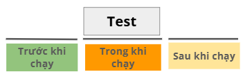
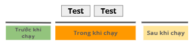
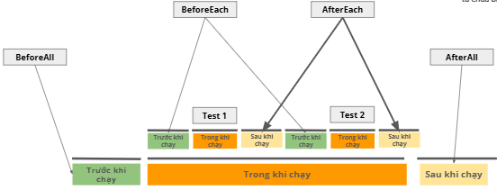
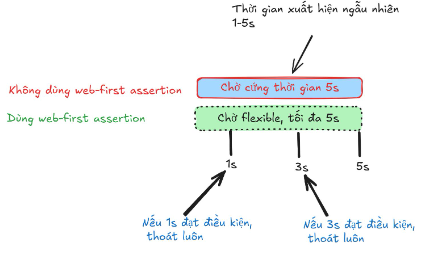

# Lesson 8
## Agenda
1. Test group/suite
2. Hooks
3. Assertion & Web first assertion
---
## Playwright - Test describe
- Test suite = tập hợp testcases
- Test suite giúp nhóm các test lại cho dễ quản lý
- Test suite trong playwright
```javascript
test.describe('<tên suite>', async
({ page }) => {
    test('test1', async () => {
        //code..
    });

    test('test2', async () => {
        //code..
    });
});
```
## Playwright - Test Hooks
- Các thời điểm chạy test:
    - Trước khi chạy
    - Trong khi chạy
    - Sau khi chạy


- Các thời điểm chạy suite:
    - Trước khi chạy
    - Trong khi chạy
    - Sau khi chạy


- Playwright gọi các thời điểm này là **Hooks**
- Các hooks:
    - beforeAll
    - beforeEach
    - afterEach
    - afterAll


---
## Playwright - Assertion
**Assertion** trong lập trình nghĩa là "Khẳng định" hoặc "Xác nhận"

Assertion là 1 câu lệnh để kiểu tra xem 1 điều gì đó có đúng như mong đợi hay không

**Tại sao cần Assertion**

Không có Assertion = không biết test có thành công hay thất bại

**Playwright** assert thông qua **hàm expect**
```javascript
import { test, expect } from '@playwright/test'

test('test01', async ({ page }) => {
    //Khẳng định title trang phải là "Homepage"
    await expect(page).toHaveTitle('Homepage');

    //Khẳng định rằng: button phải visible (nhìn thấy được)
    await expect(page.locator('button')).toBeVisible();

    //Khẳng định rằng: giá trị phải bằng 5
    await expect(2 + 3).toBe(5);
});
```

| **Không có Assertion**| **Có Assertion**|
|------------|----------|
| Chỉ thực hiện hành động | Kiểm tra kết quả có đúng không |
| await click('button') | await expect(page.locator('button')).toBeVisible() |
| "Tôi click nút" | "Tôi kiểm tra xem nút có hiển thị không |

---
**Các loại assertion:**
- **Generic Assertions** (từ thư viện expect)
    - expect(giá trị) = (giá trị)
    - VD:
        - expect(value).toBe(expected);
        - expect(array).toHaveLength(3);
        - expect(string).toContain('text');
- **Web-first Assertions Auto-waiting**
    - expect(phần tử) có giá trị
    - Dùng cho các element trên web, tự động chờ cho đến khi điều kiện được thỏa mãn
    - VD:
        - await expect(page.locator('button')).toBeVisible();
        - await expect(page).toHaveTitle(/Homepage/);

## Web-first Assertions phổ biến
**Element State**
```javascript
// Kiểm tra Visibility
await expect(locator).toBeVisible();
await expect(locator).toBeHidden();

// Kiểm tra Enabled/Disabled
await expect(locator).toBeEnabled();
await expect(locator).toBeDisabled();

// Kiểm tra Checked (checkbox/radio)
await expect(locator).toBeChecked();

// Kiểm tra Focus
await expect(locator).toBeFocused();
```

**Text & Content**
```javascript
// Có chứa text
await expect(locator).toContainText('Hello');

// Text chính xác
await expect(locator).toHaveText('Welcome');

// Text khớp regex
await expect(locator).toHaveText(/welcome/i);

// Kiểm tra nhiều elements
await expect(locator).toHaveText(['item 1', 'item 2']);
```
**Attributes and Properties**
```javascript
// Kiểm tra attributes
await expect(locator).toHaveAttribute('href', '/about');

// Kiểm tra class
await expect(locator).toHaveClass('active');
await expect(locator).toHaveClass(/btn-primary/);

// Kiểm tra value (input fields)
await expect(locator).toHaveValue('john@email.com');

// Kiểm tra count
await expect(locator).toHaveCount(5);
```
**Page assertion**
```javascript
// URL
await expect(page).toHaveURL('https://example.com');

//Title
await expect(page).toHaveTitle('My App');
```

So sánh timeout khi dùng web-first assertion hoặc không
