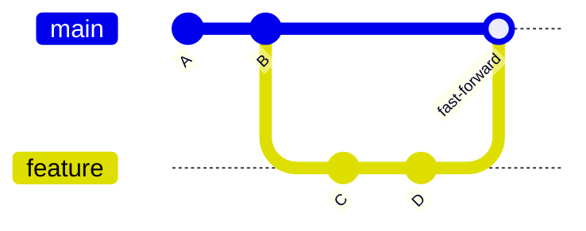
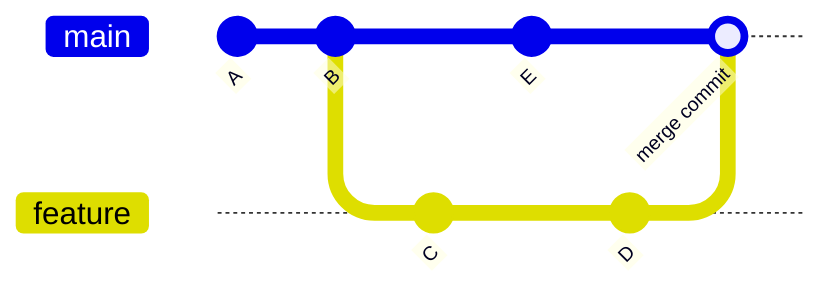

# Git & Playwright — Ghi chú học tập

> 📌 **Callout:** Tài liệu này tổng hợp lại kiến thức về **Git workflow khi làm việc nhóm** và **Playwright Locators**. Paste trực tiếp vào Notion (Ctrl/Cmd + V) để giữ format.
> 

---

## 📑 Mục lục

1. Git — Tổng quan làm việc nhóm
2. Git Merge
3. Git Conflict
4. Git Rebase
5. Git Squash
6. Playwright — Tổng quan
7. CSS Selector
8. Playwright Locators

---

## 1. Git — Tổng quan làm việc nhóm

Khi làm việc nhóm, mỗi người code trên nhánh (branch) riêng, sau đó **gộp** công việc lại với nhau.

| Thuật ngữ | Ý nghĩa |
| --- | --- |
| 🔀 **Merge** | Gộp code từ nhánh này sang nhánh khác |
| ⚔️ **Conflict** | 2 người cùng sửa 1 vị trí → git không tự gộp được |
| 📦 **Squash** | Gom nhiều commit nhỏ lẻ thành 1 commit |
| 🧱 **Rebase** | Đổi "gốc" (base) của nhánh, giúp lịch sử commit sạch hơn |

---

## 2. Git Merge

**Merge code** = gộp nhánh A vào nhánh B.

### 2.1 Fast-forward merge

- ✅ Không tạo ra **commit merge**
- Xảy ra khi **nhánh chính (main) không có thay đổi gì mới** kể từ lúc tạo nhánh feature



### 2.2 Three-way merge

- ✅ Có tạo ra **commit merge** riêng
- Xảy ra khi **lịch sử 2 nhánh đã khác nhau** (cả 2 đều có commit mới)



### 🔍 So sánh 2 loại merge

| Tiêu chí | Fast-forward | Three-way |
| --- | --- | --- |
| Commit merge mới | ❌ Không | ✅ Có |
| Điều kiện | Nhánh chính không đổi | Cả 2 nhánh đều có commit mới |
| Lịch sử commit | Thẳng, gọn | Có nhánh rẽ (branching) |

> 💡 **Tip:** Muốn merge mà **không tạo commit merge**, hãy chạy `git rebase <tên_nhánh>` **trước khi** merge.
> 

---

## 3. Git Conflict

**Conflict (xung đột)** xảy ra khi 2 người **cùng sửa 1 file** ở cùng vị trí, sau đó merge vào nhau → Git không tự quyết định được giữ nội dung nào.

!image.png

### 3.1 Cấu trúc conflict marker

```
<<<<<<< HEAD
Nội dung đang ở nhánh của mình (current branch)
=======
Nội dung ở nhánh muốn merge vào (incoming change)
>>>>>>> <tên-nhánh>
```

| Ký hiệu | Ý nghĩa |
| --- | --- |
| `<<<<<<< HEAD` → `=======` | **Current change** — nội dung nhánh hiện tại |
| `=======` → `>>>>>>> <branch>` | **Incoming change** — nội dung nhánh muốn merge vào |

### 3.2 Quy trình xử lý conflict

1. 📖 Đọc code, xác định vị trí conflict
2. ✍️ Giải quyết các conflict **dễ** — không cần trao đổi trước
3. 🗣️ Với conflict **khó** — trao đổi với author trước khi merge

> ⚠️ **Callout quan trọng:** Tránh tự ý xoá code của người khác khi chưa chắc chắn — luôn confirm lại với người viết code đó trước khi merge.
> 

---

## 4. Git Rebase

**Rebase** = thay đổi **base (gốc)** của nhánh, giúp lịch sử commit sạch và thẳng hàng hơn (không có commit merge rẽ nhánh).

```bash
git rebase <tên_nhánh>
```

**Ví dụ:**

```bash
git checkout feature
git rebase main
```

> 📌 **Callout:** Rebase viết lại lịch sử commit — **không nên rebase nhánh đã push và người khác đang dùng chung**, dễ gây conflict lịch sử cho cả team.
> 

---

## 5. Git Squash

**Squash** = gộp nhiều commit nhỏ lẻ thành **1 commit duy nhất** → lịch sử gọn gàng, dễ đọc.

### 5.1 Cú pháp

```bash
git rebase -i HEAD~<số_lượng_commit>
```

**Ví dụ:** gộp 3 commit gần nhất

```bash
git rebase -i HEAD~3
```

### 5.2 Các bước thực hiện (trong Vim)

1. Chạy lệnh → mở giao diện Vim liệt kê các commit
2. Giữ dòng đầu là `pick`, đổi các dòng còn lại thành `squash` (hoặc `s`)

```
pick a1b2c3 commit 1
squash d4e5f6 commit 2
squash g7h8i9 commit 3
```

1. Lưu và thoát: nhấn `Esc` → gõ `:wq` → Enter
2. Vim mở tiếp màn hình chỉnh sửa **message** cho commit gộp → sửa lại nội dung → `:wq` để lưu

---

## 6. Playwright — Tổng quan

📚 Tài liệu tham khảo: playwright.dev/docs/locators

Playwright hỗ trợ 2 cách chính để tìm phần tử trên trang:

- 🎯 **CSS Selector**
- 🎯 **Playwright Locator** (khuyến khích dùng)

---

## 7. CSS Selector

Tài liệu tham khảo: https://appletree.or.kr/quick_reference_cards/CSS/CSS selectors cheatsheet.pdf

Là cú pháp có sẵn để chọn phần tử HTML trong DOM, dùng phổ biến trong CSS Styling.

!image.png

**Ví dụ:**

```css
.btn-submit        /* chọn theo class */
#login-form         /* chọn theo id */
div > button        /* chọn theo cấu trúc cha-con */
```

### ⚖️ So sánh CSS Selector vs XPath

| Tiêu chí | CSS Selector | XPath |
| --- | --- | --- |
| Cú pháp | Ngắn gọn | Dài, phức tạp hơn |
| Hiệu năng | ⚡ Nhanh hơn | Chậm hơn |
| Khả năng chọn phần tử | Có hạn chế (khó chọn theo text, sibling ngược) | Linh hoạt hơn |

---

## 8. Playwright Locators

Tham khảo: https://material.playwrightvn.com/03-playwright-selectors.html

Hệ thống **locator** mạnh mẽ và linh hoạt của Playwright để tìm và tương tác với phần tử trên trang.

| Locator | Tìm theo |
| --- | --- |
| `getByRole()` | ARIA role |
| `getByText()` | Text hiển thị |
| `getByLabel()` | Label liên kết với input |
| `getByPlaceholder()` | Placeholder |
| `getByAltText()` | Thuộc tính `alt` (thường dùng cho ảnh) |
| `getByTitle()` | Thuộc tính `title` |
| `getByTestId()` | `data-testid` |

### 8.1 `page.getByRole()`

Tìm element theo **ARIA role**.

!image.png

**Role phổ biến:** `button`, `link`, `textbox`, `radio`, `heading`, `listitem`

```jsx
await page.getByRole('button', { name: 'Submit' }).click();
await page.getByRole('heading', { name: 'Đăng nhập' });
```

### 8.2 `page.getByText()`

Tìm element theo **text hiển thị** trên trang.

!image.png

```jsx
await page.getByText('Hello', { exact: true });
```

> 💡 **Tip:** Có thể kết hợp với locator khác để thu hẹp phạm vi tìm kiếm:
> 

```jsx
await page.locator('div').getByText('Hello');
await page.getByRole('button', { name: /submit/i }).click();

await page.getByRole('button', { name: /^submit$/i }).click();
```

Input với Type là “button” hoặc “submit” thì luôn tìm theo “value” chứ không phải text content

### 8.3 `page.getByLabel()`

Tìm **input element** thông qua text của `<label>` liên kết với nó.

!image.png

```jsx
await page.getByLabel('Email');
await page.getByLabel('Email', { exact: false }); // khớp gần đúng, không cần trùng 100%
```

> 📌 `exact: false` → so sánh **gần đúng** (chứa text), không yêu cầu khớp chính xác toàn bộ chuỗi.
> 

### 8.4 `page.getByPlaceholder()`

Tìm input theo nội dung **placeholder**.

!image.png

```jsx
await page.getByPlaceholder('Nhập số điện thoại');
```

### 8.5 `page.getByTitle()`

Tìm element theo thuộc tính **title**.

!image.png

```jsx
await page.getByTitle('Đóng cửa sổ');
```

### 8.6 `page.getByAltText()`

Tìm element (thường là ``) theo thuộc tính **alt**.

!image.png

```jsx
await page.getByAltText('Logo công ty');
```

### 8.7 `page.getByTestId()`

Tìm element theo thuộc tính **data-testid** — cách ổn định nhất, ít bị ảnh hưởng khi UI thay đổi.

!image.png

```jsx
await page.getByTestId('submit-button');
```

> ✅ **Best practice:** Ưu tiên `getByRole()` và `getByTestId()` khi có thể — vừa gần với cách người dùng thật tương tác, vừa ổn định khi code UI thay đổi.
>