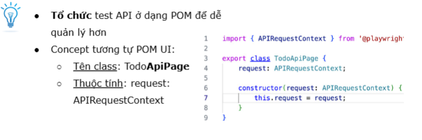
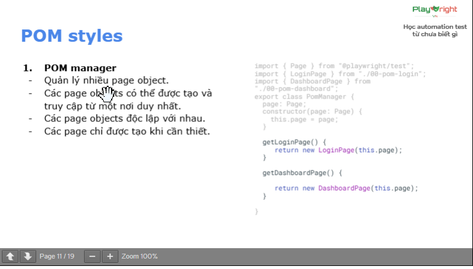
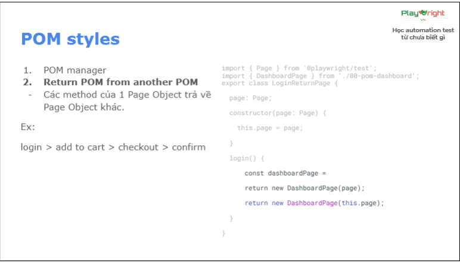

# POM cho API 
## Lý do:
- Tổ chức test ở dạng POM để dễ quản lí hơn
- Concept tương tự POM UI:
    + Tên class: TodoApiPage
    + Thuộc tính: request: APIRequestContext

    + Tư duy tương tự: 
                 thuộc tính: những gì cần thiết cho API: request fixture, baseURL
                 phương thức: các hàm gọi API
## POM API nâng cao:
- Lưu baseURL để khi gọi API ngắn gọn hơn
- Thêm thuộc tính token để lưu lại token với các API dùng token

## Các POM styles:
- Style phổ biến là "kế thừa", vì page phía sau sẽ kế thừa page phía trước
- Style 2: POM manager
    + Quản lí nhiều page object
    + Các page objects có thể được tạo và truy cập từ 1 nơi duy nhất
    + Các page objects độc lập với nhau
    + Các page chỉ được tạo khi cần thiết

- Style 3: POM return
    + Return POM from another POM: các method của 1 Page Object trả về Page Object khác.
Ex: login > add to cart > checkout > confirm

## Async, await
- Là cách viết code JS/TS để xử lí các tác vụ bất đồng bộ (asynchronous)
        + async: đặt trước function để biến nó thành async function (trả về Promise)
        + await: đặt trước 1 Promise để "chờ" nó hoàn thành trước khi chạy tiếp
- Cơ chế hoạt động JS: Event-Loop single thread. Dùng async await để function/Promise chờ trước khi qua function mới (JS chạy theo kiểu bất đồng bộ, function chạy multi thread với nhau ko tuần tự)

-Dùng async await đúng cách:
        + Luôn dùng await với:
                            - page.goto()
                            - page.click()
                            - page.fill()
                            - expect() assertions
                            - bất kì method nào trả về Promise
        + Ko cần await với:
                            - page.locator()
                            - biến thông thường
                            - synchronous operations
