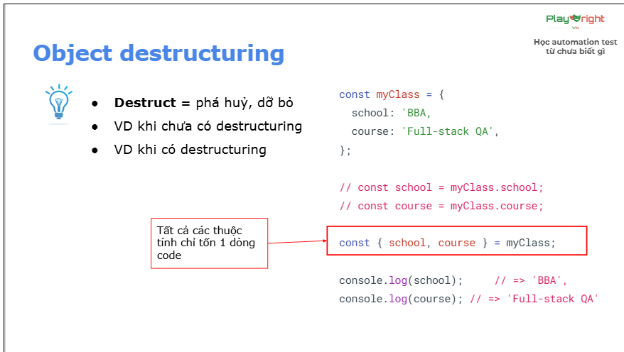
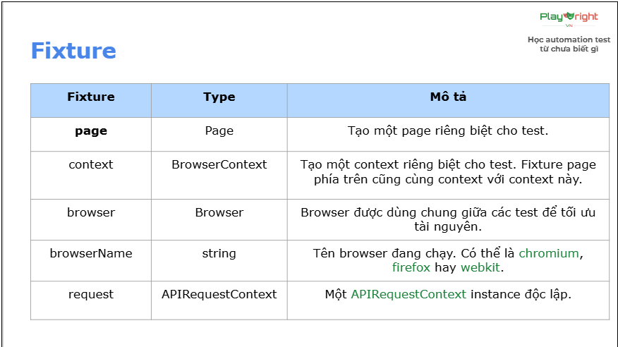

# Object Destructuring, Fixture, Test Generator And Video Recording

## I/ Object destructuring:
- Destruct: phá hủy, dỡ bỏ
Trong context JS, destruct = lấy các giá trị của các thuộc tính trong object 

## II/ Fixture:
- Built-in fixture (fixture có sẵn): Playwright sử dụng concept fixture (page, request).
- Ý nghĩa fixture: 
                    + Tái sử dụng setup/teardown code.
                    + Chia sẻ objects giữa các test
                    + Tạo môi trường test độc lập
                    + Mở rộng built-in fixtures (page, context, browser)
                    + Nhóm test theo ngữ nghĩa thay vì common setup
- Built-in fixture: 

- Custom một fixture: sử dụng test.extend() để mở rộng test object.
Ex: viết 1 fixture tự động tạo 1 POM và truy cập Material Page!

###
import {test as base} from '@playwright/test'

const test = base.extend <{page2: Page2}>({
    page2: async({}, use) => {
        const page2 = new Page2();
        page2.sayMyName();
        await use(page2);
        console.log("after page2");
    }
})

export {test};
###

## III/ Test generator:
- Là việc thao tác mà sinh ra code (click sinh ra code)
- When we use: cần code nhanh
- Sử dụng: 
         + Record new: tạo file mới và bắt đầu record
         + Record as cursor: record và sinh ra code tại vị trí con trỏ chuột
         + Assertion: generate ra so sánh
## IV/ Video recording:
- Là việc quay video lại toàn bộ quá trình test chạy
- Giúp debug các test 1 cách dễ dàng hơn
- Giúp generate ra evidence nhanh chóng
- Cách dùng: sửa trong file playwright.config.ts, mục use
- Các mode: 
            + off: tắt, ko record
            + on: bật, record tất cả các test
            + retain-on-failure: record hết, nhưng chỉ giữ lại test fail
            + on-first-retry: record những test nào fail và retry

