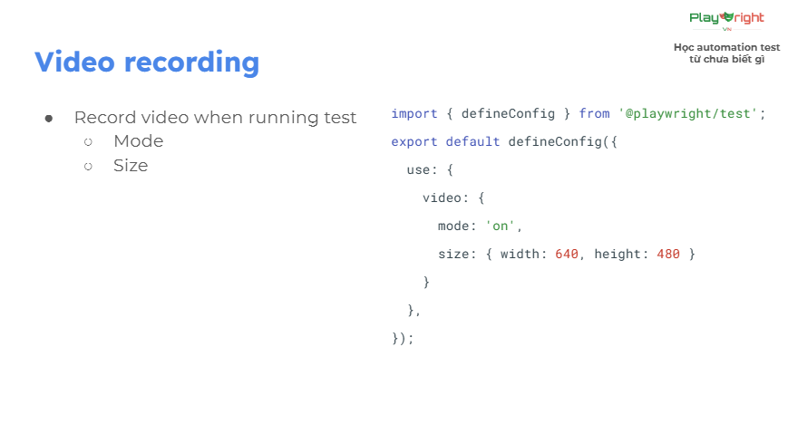
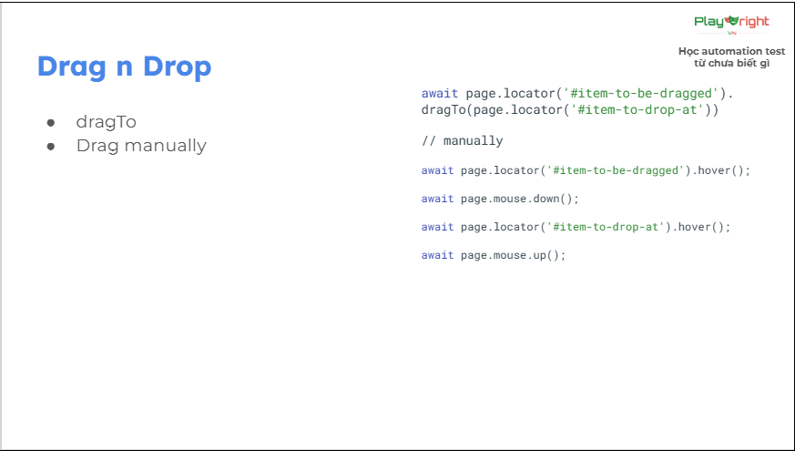

# Many concepts
## Visual Comparison
- Generate screenshot
- Update screenshot
    + Remove old file
    + Using terminal command:
                    ++ --update-snapshots
                    ++ npx playwright test -g "@IMAGE" --update-snapshots
    + Mask locator: Mask, maskColor
## Video Recording
- Record video when running test: 
    + Mode
    + Size
## Test Report: 
https://playwright.dev/docs/test-reporters#third-party-reporter-showcase
## Test Emulation:
- Devices
- Viewport
- Locale & timezone
- Color scheme
- Geolocation
- Permission
- Further reading: https://playwright.dev/docs/emulation
## Drag And Drop: 

- dragTo
- drag manually

## Global setup & teardown:
- GlobalSetup: chạy trước khi tất cả các test chạy, chỉ chạy MỘT LẦN DUY NHẤT
- GlobalTeardown: chạy sau khi tất cả các test chạy, chỉ chạy MỘT LẦN DUY NHẤT
- So sánh với fixture:
                    + Fixture chạy lại mỗi khi test chạy
                    + Global setup & teardown chỉ chạy một làn duy nhất
- How to use: 
    + Fixture: dùng khi logic cần chạy riêng từng test
    + Global setup & teardown: dùng khi logic chỉ cần chạy một lần duy nhất