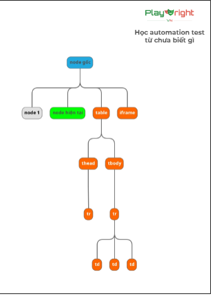

**LESSON-7: Git, Selector Advanced**

**I/ DOM: relation**
- self: node hiện tại
- parent: cha
- children: con (node phía dưới trực tiếp của node hiện tại)
- ancestor: tổ tiên
- descendant: hậu duệ (là các node con, cháu, chắt)
- sibling: anh em (những phần tử cùng cấp và cùng cha)

- following: theo sau (gồm các node phía bên tay phải node hiện tại)
**NOTE: ko lấy những thằng con của node hiện tại**

- preceding: phía trước (các node phía tay trái node hiện tại)
- following-sibling: anh em phía sau
- preceding-sibling: anh em phía trước

**II/ XPATH**
- Wildcard: *: khớp tất cả
- Child: con trực tiếp
- Descendant: tất cả con cháu
- Parent: tìm cha
- Ancestor: tìm tổ tiên
- Following
- Preceding
- Following-sibling
- Preceding-sibling
- And và Or operator
- Text()
- Normalize-space(): loại bỏ khoảng trắng thừa ở đầu, cuối và giữa text
- Contains(): kiểm tra chứa chuỗi con

