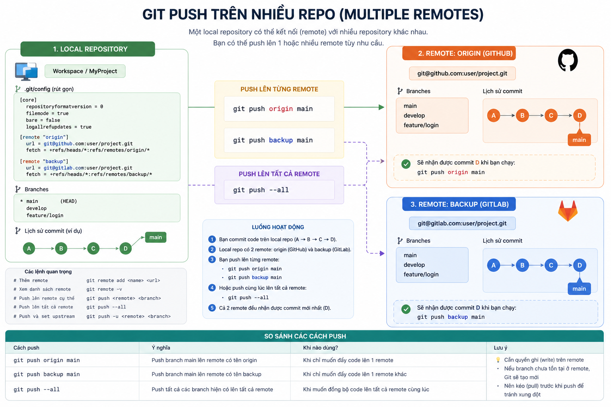
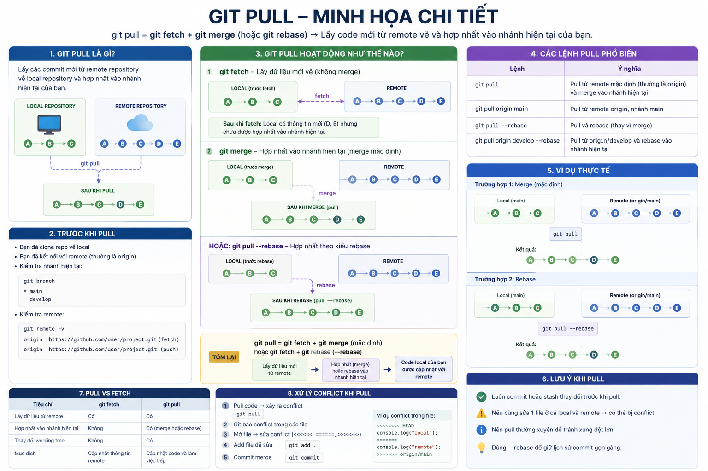

# 🚀 Git


## 📥 Clone, Pull, Push

### 🔹 Clone

- `Clone` là hành động lấy source code từ một repository có sẵn về máy cá nhân


### 📌 Câu lệnh clone

```bash
git clone <link_repo>
```

### 📌 Clone với tên thư mục mới

```bash
git clone <link_repo> <ten_moi>
```

##### 💡 Ví dụ
```bash
git clone git@github.com:better-bytes-academy/k18-practice.git k18-practice-2
```

### 🚀 Git Push

#### 📌 Push đến một repository khác

```bash
git push <remote_name> <branch_name>
```

##### 💡 Ví dụ
```bash
git remote add origin git@github.com:user/demo.git
```



### 📥 Git Pull


- `git pull` dùng để:
  - Lấy code mới nhất từ remote repository
  - Đồng bộ code từ GitHub/GitLab về local

#### 📌 Cú pháp cơ bản
```bash
git pull
```

#### 📌 Pull từ branch cụ thể
```bash
git pull origin main
```

##### 💡 Ví dụ
```bash
git pull origin develop
```



### 📦 Git Stash

#### 📌 Git Stash là gì?

- `git stash` dùng để:
  - Lưu tạm các thay đổi chưa commit
  - Đưa working directory về trạng thái sạch

👉 Thường dùng khi:
- Đang code dở
- Muốn chuyển branch
- Muốn pull code nhưng chưa muốn commit

#### 🎯 Summary

| Lệnh | Mục đích |
|------|-----------|
| `git stash` | Lưu tạm thay đổi |
| `git stash save <ten_stash>` | Lưu tạm thay đổi với một tên cụ thể |
| `git stash -u` | Stash cả file untracked |
| `git stash list` | Xem danh sách stash |
| `git stash apply` | Khôi phục stash |
| `git stash pop` | Khôi phục + xoá stash |
| `git stash pop <ten_stash>` | Khôi phục + xoá stash cụ thể |
| `git stash clear` | Xoá toàn bộ stash |

###  🔀 Tạo Pull Request trên GitHub

- Vào repository trên GitHub
- Chọn:

```text
Compare & pull request
```
#### 📌 Chọn branch

| Loại branch | Giá trị |
|-------------|----------|
| Base branch | `main` |
| Compare branch | `feat/login` |

#### 📝 Add title + description

##### 💡 Ví dụ title

```text
feat: add login feature
```
##### 💡 Ví dụ description

```text
- Add login UI
- Add validation
- Update API integration
```

#### 🎯 Sau khi tạo PR

- Reviewer sẽ review code
- Resolve comment (nếu có)
- Merge vào branch chính

#### 📌 Một số trạng thái thường gặp

| Trạng thái | Ý nghĩa |
|------------|----------|
| `Open` | PR đang mở |
| `Review` | Đang được review |
| `Merged` | Đã merge |
| `Closed` | Đã đóng |

## 📘 Git Convention


### 📌 Convention là gì?

- Convention = bộ quy tắc


#### 🎯 Convention giúp

- Gọn gàng, đồng bộ
- Dễ đoán được ý đồ của PR / commit

#### 🌿 Convention đặt tên branch

##### 📌 Format

```text
<type>/<short-description>
```
#### 🏷️ Type thường dùng

| Type | Ý nghĩa |
|------|----------|
| `feat` | Thêm tính năng mới |
| `fix` | Sửa lỗi |
| `conf` | Thay đổi cấu hình (config) |
| `chore` | Các thay đổi nhỏ: xoá file, đổi tên file... |

##### 💡 Ví dụ branch
```text
feat/checkout
fix/fill-info
feat/lesson-6-long
```

#### 🧠 short-description là gì?
- Mô tả ngắn gọn mục đích của branch được tạo ra

---

# Javascript
## 🧩 Class

#### 📌 Cấu trúc cơ bản

```javascript
class LoginPage {

}
```

##### 💡 Ví dụ

```javascript
class Student {
    // property /thuoc tinh
    name;
    role;

    // constructor / ham khoi tao
    constructor (name, role) {
        this.name = name;
        this.role = role;
    }

    // Method / phuong thuc
    sayMyname () {
        console.log(`My name is ${this.name}`);
    }

    saySomething (message) {
        return `Say something: ${message}`;
    }
}

const thuQua = new Student('Thu Qua', 'student');
console.log(thuQua);
thuQua.sayMyname();
const message = thuQua.saySomething('E101 playwright');
console.log(message);
```

