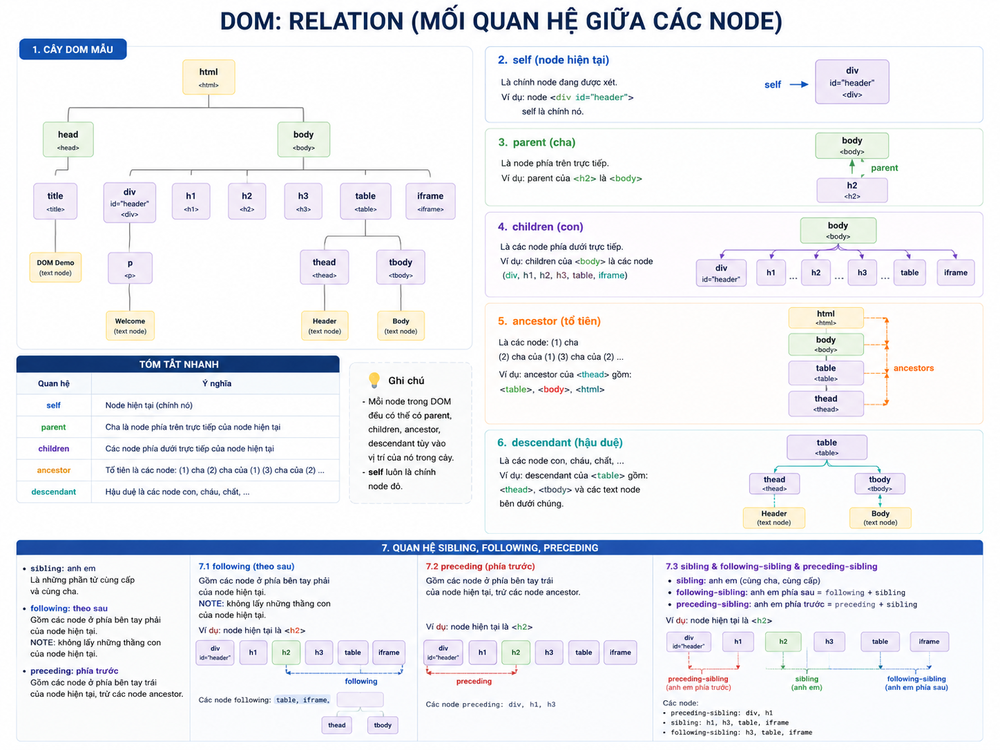
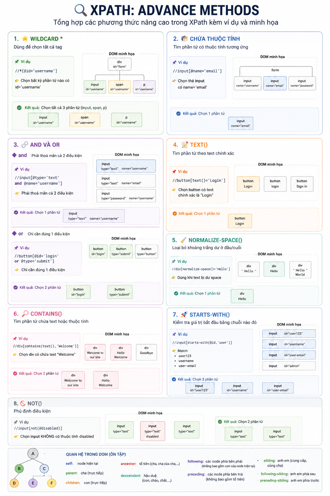
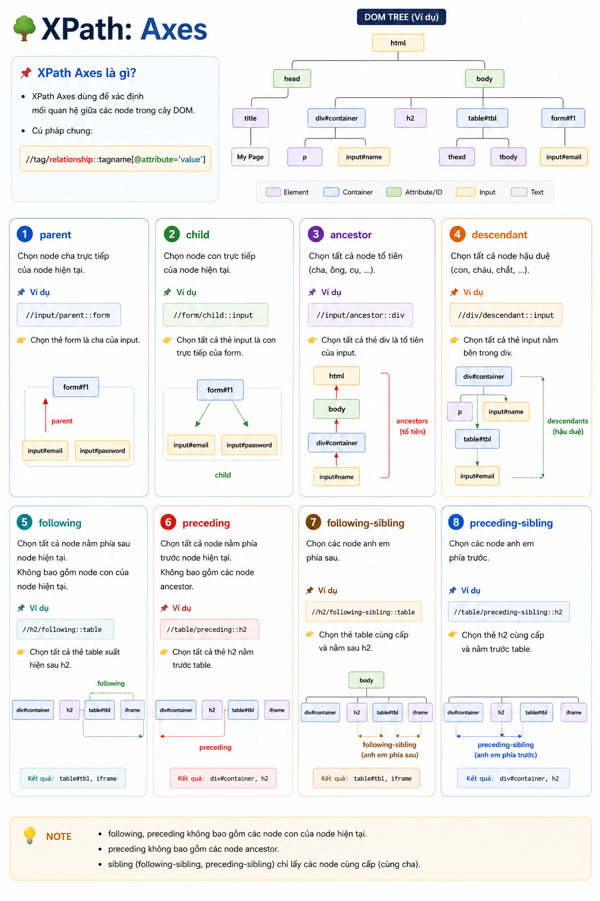

# 🌳 DOM: Relation

## 📌 Các mối quan hệ trong DOM

### 1. 🔹 self

- Node hiện tại

### 2. 🔹 parent

- Node cha
- Là node phía trên trực tiếp của node hiện tại

### 3. 🔹 children

- Các node con
- Là các node phía dưới trực tiếp của node hiện tại

### 4. 🔹 ancestor (tổ tiên)

- Là các node:
  1. Cha
  2. Cha của cha
  3. Cha tiếp theo
  4. ...

👉 Bao gồm tất cả node phía trên

### 5. 🔹 descendant (hậu duệ)

- Là các node:
  - con
  - cháu
  - chắt
  - ...

👉 Bao gồm tất cả node phía dưới

## 🌿 Các quan hệ khác trong DOM

### 6. 🔹 sibling (anh em)

- Là những phần tử:
  - cùng cấp
  - cùng cha (`parent`)

### 7. 🔹 following (theo sau)

- Gồm các node nằm phía bên phải của node hiện tại

⚠️ Lưu ý:
- Không lấy node con của node hiện tại

#### 📌 Ví dụ

Các node following:
- `table`
- `iframe`
- `thead`
- `tbody`

### 8. 🔹 preceding (phía trước)

- Gồm các node nằm phía bên trái của node hiện tại
- Không bao gồm các node `ancestor`

#### 📌 Ví dụ

Các node preceding:
- `div`
- `h1`
- `h2`
- `h3`

### 9. 🔹 following-sibling (anh em phía sau)

- Là các node:
  - cùng cấp (`sibling`)
  - nằm phía sau node hiện tại (`following`)

👉 `following-sibling = following + sibling`

### 10. 🔹 preceding-sibling (anh em phía trước)

- Là các node:
  - cùng cấp (`sibling`)
  - nằm phía trước node hiện tại (`preceding`)

👉 `preceding-sibling = preceding + sibling`

## 🎯 Summary

| Quan hệ | Ý nghĩa |
|----------|----------|
| `self` | Node hiện tại |
| `parent` | Node cha trực tiếp |
| `children` | Node con trực tiếp |
| `ancestor` | Tất cả node phía trên |
| `descendant` | Tất cả node phía dưới |
| `sibling` | Node cùng cấp, cùng cha |
| `following` | Các node phía sau |
| `preceding` | Các node phía trước |
| `following-sibling` | Anh em phía sau |
| `preceding-sibling` | Anh em phía trước |




---

# 🔍 XPath: Advance Methods

## 1. 🌟 Wildcard `*`

- Dùng để chọn tất cả tag

### 📌 Ví dụ

```text
//*[@id='username']
```
👉 Chọn bất kỳ phần tử nào có `id='username'`

## 2. 📦 Chứa thuộc tính

- Tìm phần tử có thuộc tính tương ứng

### 📌 Ví dụ

```text
//input[@name='email']
```
👉 Chọn thẻ input có `name='email'`

## 3. 🔗 and và or

### 📌 and
```text
//input[@type='text' and @name='username']
```
👉 Phải thoả mãn cả 2 điều kiện
## 📌 or
```text
//button[@id='login' or @type='submit']
```
👉 Chỉ cần đúng 1 điều kiện

## 4. 📝 text()

- Tìm phần tử theo text chính xác

### 📌 Ví dụ

```text
//button[text()='Login']
```

## 5. 🧹 normalize-space()

- Loại bỏ khoảng trắng dư ở đầu/cuối

### 📌 Ví dụ

```text
//div[normalize-space()='Hello']
```

👉 Dùng khi text bị dư space

## 6. 🔎 contains()

- Tìm phần tử chứa text hoặc thuộc tính

### 📌 Ví dụ

```text
//div[contains(text(),'Welcome')]
```

## 7. 🚀 starts-with()

- Kiểm tra giá trị bắt đầu bằng chuỗi nào đó

### 📌 Ví dụ

```text
//input[starts-with(@id,'user')]
```

👉 Match:

- `user123`
- `username`
- `user-email`

## 8. 🚫 not()

- Phủ định điều kiện

### 📌 Ví dụ

```text
//input[not(@disabled)]
```

👉 Chọn input KHÔNG có thuộc tính `disabled`



---

# 🌳 XPath: Axes


## 📌 XPath Axes là gì?

- XPath Axes dùng để xác định mối quan hệ giữa các node trong cây DOM.
- Cú pháp chung:

```text
//tag/relationship::tagname[@attribute='value']
```

## 1. 🔹 `parent`

- Chọn node cha trực tiếp của node hiện tại.

### 📌 Ví dụ

```text
//input/parent::form
```

👉 Chọn thẻ `form` là cha của `input`.


## 2. 🔹 `child`

- Chọn node con trực tiếp của node hiện tại.

### 📌 Ví dụ

```text
//form/child::input
```

👉 Chọn tất cả thẻ `input` là con trực tiếp của `form`.


## 3. 🔹 `ancestor`

- Chọn tất cả node tổ tiên (cha, ông, cụ, ...).

### 📌 Ví dụ

```text
//input/ancestor::div
```

👉 Chọn tất cả thẻ `div` là tổ tiên của `input`.


## 4. 🔹 `descendant`

- Chọn tất cả node hậu duệ (con, cháu, chắt, ...).

### 📌 Ví dụ

```text
//div/descendant::input
```

👉 Chọn tất cả thẻ `input` nằm bên trong `div`.


## 5. 🔹 `following`

- Chọn tất cả node nằm **phía sau** node hiện tại.
- Không bao gồm node con của node hiện tại.

### 📌 Ví dụ

```text
//h2/following::table
```

👉 Chọn tất cả thẻ `table` xuất hiện sau `h2`.


## 6. 🔹 `preceding`

- Chọn tất cả node nằm **phía trước** node hiện tại.
- Không bao gồm các node `ancestor`.

### 📌 Ví dụ

```text
//table/preceding::h2
```

👉 Chọn tất cả thẻ `h2` nằm trước `table`.


## 7. 🔹 `following-sibling`

- Chọn các node anh em phía sau.

### 📌 Ví dụ

```text
//h2/following-sibling::table
```

👉 Chọn thẻ `table` cùng cấp và nằm sau `h2`.

## 8. 🔹 `preceding-sibling`

- Chọn các node anh em phía trước.

### 📌 Ví dụ

```text
//table/preceding-sibling::h2
```

👉 Chọn thẻ `h2` cùng cấp và nằm trước `table`.


## 🎯 Summary

| Axes | Ý nghĩa | Ví dụ |
|------|----------|--------|
| `parent` | Cha trực tiếp | `//input/parent::form` |
| `child` | Con trực tiếp | `//form/child::input` |
| `ancestor` | Tất cả tổ tiên | `//input/ancestor::div` |
| `descendant` | Tất cả hậu duệ | `//div/descendant::input` |
| `following` | Các node phía sau | `//h2/following::table` |
| `preceding` | Các node phía trước | `//table/preceding::h2` |
| `following-sibling` | Anh em phía sau | `//h2/following-sibling::table` |
| `preceding-sibling` | Anh em phía trước | `//table/preceding-sibling::h2` |

