# Visual Comparisons

Provides us the ability to produce and visually compare screenshots using 

```jsx
await expect(page).toHaveScreenshot({
	fullPage: true,
})
```

By default, Playwright only takes a screenshot of the viewport.

`fullPage: true`:  option to take whole of page

- Takes a screenshot of the current page.
- Compares it against a stored baseline screenshot.
- Detects UI regressions such as:
    - Layout shifts
    - Missing elements
    - Styling changes
    - Unexpected text changes
- Generates diff images when mismatches occur.

## Generate screenshot

1. First run: generate baseline screenshot and fail.

    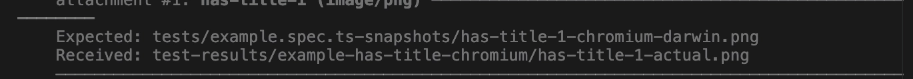
    
2. Second run: compare with baseline and pass if matched.
    
    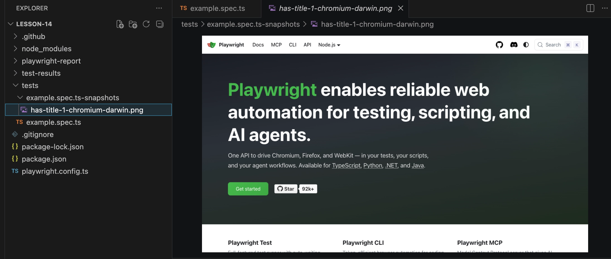

3. The test fails if visual changes cause differences from the baseline screenshot.
    
    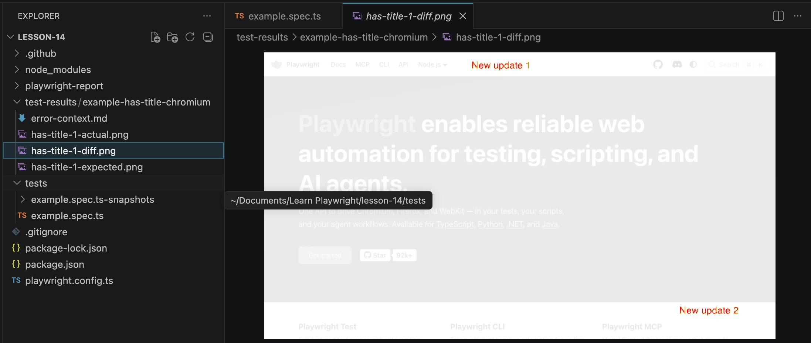

4. Playwright generates diff images and highlights the changed areas to help identify visual regressions.

## Update the baseline screenshots

Playwright replaces existing baseline images with the current screenshots.

Use this option only when visual changes are expected and have been verified.

```jsx
npx playwright test lesson-14/tests/example.spec.ts --update-snapshots
```

## Mask locator

The mask option hides specific elements before taking a screenshot.

Use it for dynamic content that changes between test runs, such as:

- Timestamps
- User avatars
- Random IDs
- Session tokens

This helps reduce false failures in visual tests.

- Before mask: Advertisements often change between test runs, causing visual test failures.
    
    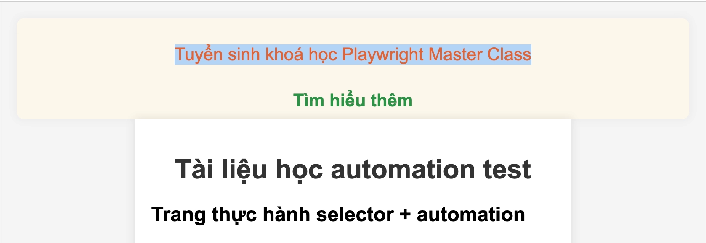

- After mask (pink mask as default): Use mask locators to hide them from screenshot comparisons.
    
    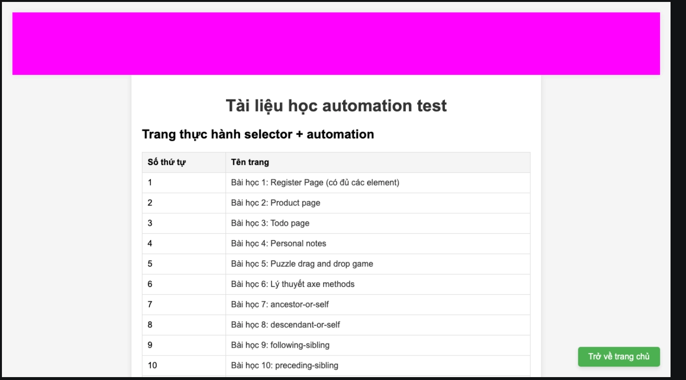
    
    Update other colors
    
    ```jsx
      await expect(page).toHaveScreenshot({
        mask: [
          page.locator('#ads-here'),
          page.locator('//a[@href="index.html"]')
        ],
        maskColor: '#7b00ff', //purple
      }) 
    ```

# Test report

One of Playwright's strengths is its visual testing support.

When a screenshot comparison fails, Playwright:

- Provides detailed error logs.
- Generates actual, expected, and diff screenshots.
- Highlights changed areas.
- Offers a slider view for easy visual comparison.

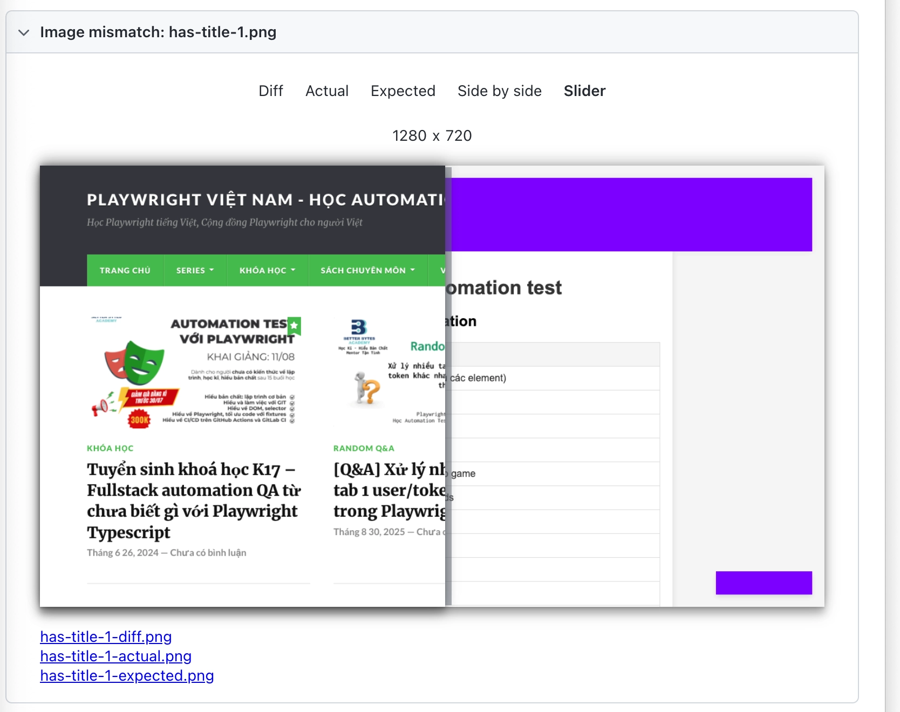

## Trace

Update in `playwright.config.ts`  file 

```jsx
  use: {
    trace: 'on',
  },
```

The Trace Viewer records the complete test execution, making it easier to investigate failures.

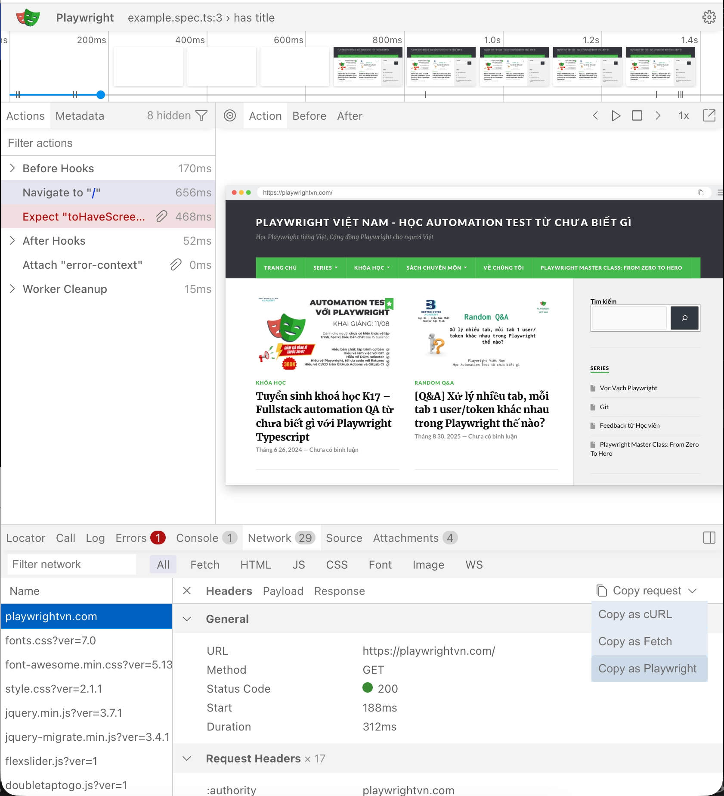

Playwright provides a prompt with relevant failure context that can be copied into AI tools such as ChatGPT or Claude for further analysis.

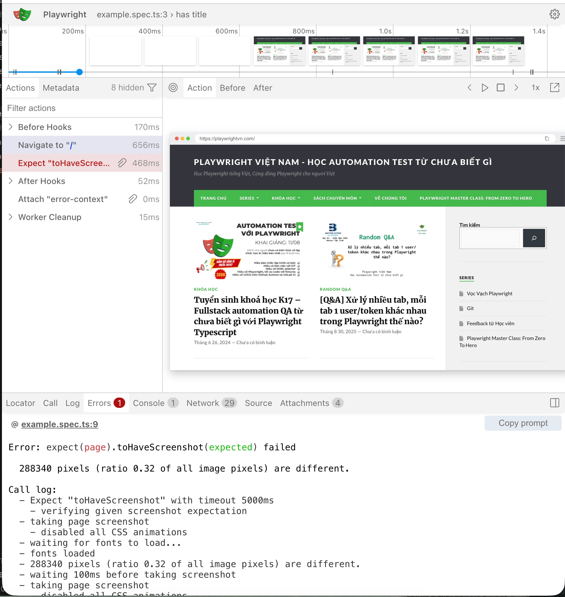


# Test emulation

## Devices

https://playwright.dev/docs/emulation#devices

Update in `playwright.config.ts`

```jsx
  projects: [
    {
      name: 'Mobile Safari',
      use: {
        ...devices['iPhone 13'],
      },
    }
  ]
```


## Viewport

Used to set the window size. It can also be configured at the test case level.

```jsx
  projects: [
    {
      name: 'Mobile Safari',
      use: {
        ...devices['iPhone 13'],
        viewport: { width: 1280, height: 720 },

      },
    }
  ]
```

The window size is set to { width: 1280, height: 720 }

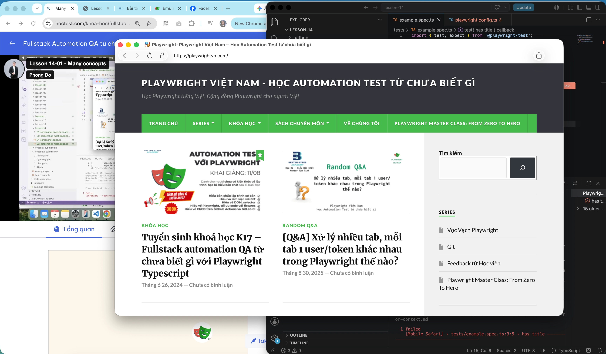

## Locale & timezone

Supports testing in different locales and timezones

Setting in `use`

```jsx
  use: {
    // Emulates the browser locale.
    locale: 'en-GB',

    // Emulates the browser timezone.
    timezoneId: 'Europe/Paris',
  },
```

Runs the test using the configured timezone.

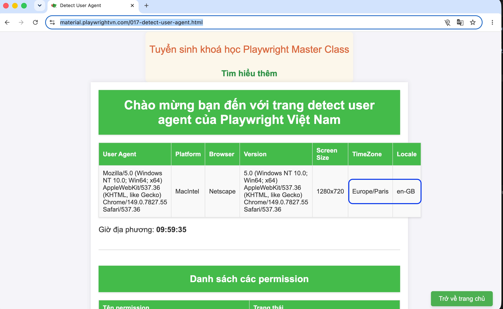

### Set in test level

```jsx
import { test, expect } from '@playwright/test';

test.use({
  locale: 'de-DE',
  timezoneId: 'Europe/Berlin',
});

test('has title', async ({ page }) => {
  await page.goto('https://material.playwrightvn.com/017-detect-user-agent.html');

});
```

## Permission

Set browser permissions

https://playwright.dev/docs/api/class-browsercontext#browser-context-grant-permissions

In config file

```jsx
  use: {
    permissions: ['camera', 'geolocation', 'microphone'],
  },
```

In test

```tsx
import { test, expect } from '@playwright/test';

test.use({
  locale: 'de-DE',
  timezoneId: 'Europe/Berlin',
});

test.beforeEach(async ({ context }) => {
  // Runs before each test and signs in each page.
  await context.grantPermissions(['camera', 'geolocation', 'microphone'], { origin: 'https://material.playwrightvn.com/017-detect-user-agent.html' });
});

test('has title', async ({ page }) => {
  await page.goto('https://material.playwrightvn.com/017-detect-user-agent.html');

});
```

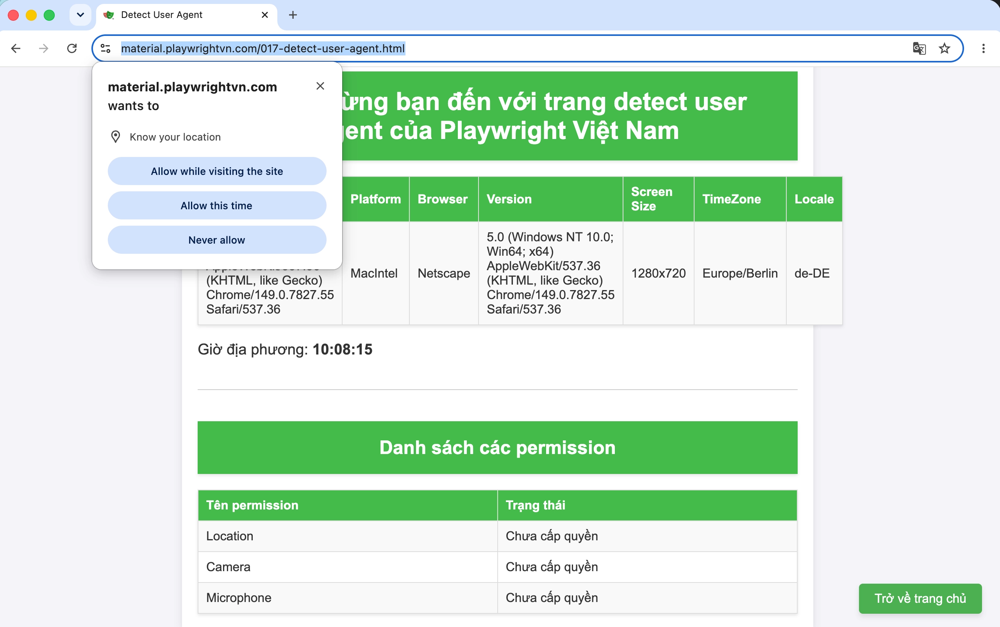

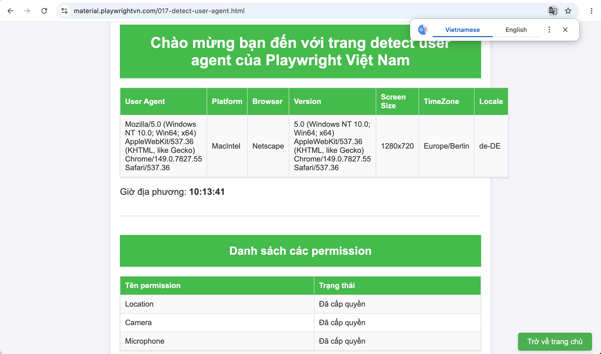

## Color Scheme

Set dark or light mode

In config

```jsx
  use: {
    colorScheme: 'dark',
    }
```

## Geolocation

Grant "geolocation" permissions and set geolocation to a specific area.

```jsx
import { defineConfig } from '@playwright/test';

export default defineConfig({
  use: {
    // Context geolocation
    geolocation: { longitude: 12.492507, latitude: 41.889938 },
    permissions: ['geolocation'],
  },
});
```

# Playwright actions
## Drag and drop

```jsx

test('has title', async ({ page }) => {
  await page.goto('https://material.playwrightvn.com/05-xpath-drag-and-drop.html');

  // from
  const fromLocator = page.locator('//*[@id="piece-1"]');

  // to
  const toLocator = page.locator('//div[@data-piece="1"]');

  await fromLocator.dragTo(toLocator);
});
```